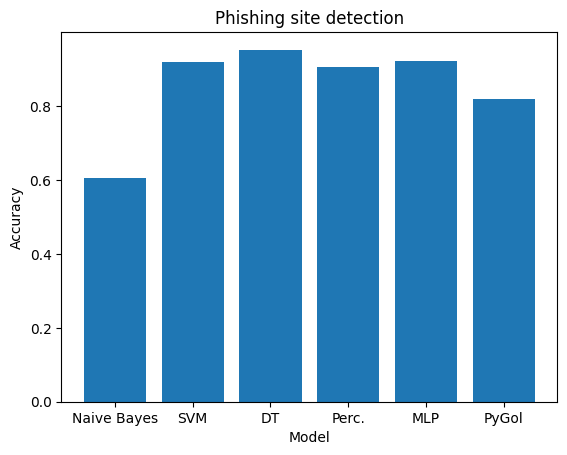

# Phishing Site Detection Using ILP
This projects generates a general hypotheses using the Inductive Logic Programming approach and compares it with traditional machine learning approaches.

## Algorithm
The hypotheses generation is done using a novel ILP Algorithm called [PyGol](https://github.com/danyvarghese/PyGol). It is comparatively faster than the other ILP systems and is implemented in python. It uses SWI-prolog via janus-swi to evalutae the generated theory.

## Dataset
This project uses the phishing dataset provided by the [UCI Machine Learning Repository](https://archive.ics.uci.edu/dataset/327/phishing+websites).
The features on the dataset is mainly based on various phishing techniques and are encoded as 
- -1 : phishing characteristic
- 0  : suspicious characteristic
- 1  : legitimate characteristic

## Results

The ILP based classifier attained an accuracy of 82.2% and the decision tree model had the highest accuracy (96%). The accuracy could be increased by increasing the number of literals in the hypotheses or by tweaking other parameters.. This still has to be tested

